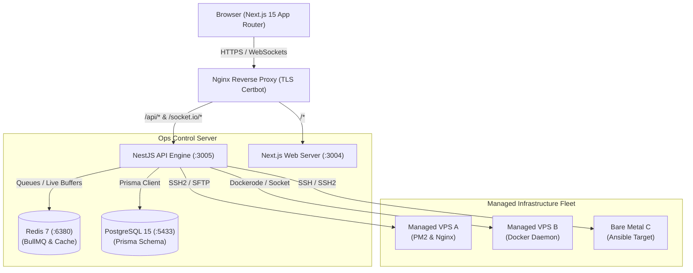

# Hamyar Ops: Next-Generation Self-Hosted DevOps & Fleet Control Platform
## Strategic Project Proposal & Technical Roadmap

> [!NOTE]
> This proposal outlines the architectural advantages, complete module capabilities, dashboard views, and strategic roadmap for **Hamyar Ops**. It is designed to establish a clear path from a robust self-hosted orchestration tool to a highly scalable, enterprise-ready Internal Developer Platform (IDP).

---

## 1. Executive Summary

Modern engineering teams face a double-edged sword: the ease of modern cloud platforms (Vercel, Render, Heroku) vs. the rapidly compounding costs of SaaS subscriptions and vendor lock-in. 

**Hamyar Ops** is a self-hosted, production-grade DevOps and fleet operations platform. Built on **NestJS 10** and **Next.js 15**, it consolidates server monitoring, application deployment (Docker & PM2), Infrastructure as Code (Terraform & Ansible), backup automation, and log aggregation into a single, cohesive, self-hosted dashboard.

### Core Value Pillars
* **Absolute Sovereignty:** 100% self-hosted. Your code, your SSH keys, and your environment variables never leave your network.
* **Unified Control Plane:** Replaces multiple fragmented tools (Portainer, Ansible Tower, Terraform Cloud, Datadog, UFW scripts) with one dashboard.
* **Hybrid Workloads:** Native support for both PM2 processes (ideal for lightweight Node.js microservices) and Docker Containers (for multi-language containerized architectures).

---

## 2. System Architecture

Hamyar Ops employs a lightweight, high-performance architecture optimized for low-overhead fleet orchestration.



### Technical Design Patterns
1. **Event-Driven Execution:** High-overhead tasks (such as Ansible runs, Terraform apply operations, and backups) are queued via **BullMQ** and processed asynchronously.
2. **Real-time Synchronization:** A global **Socket.IO** gateway streams process statuses, container states, and real-time execution logs directly to the browser.
3. **Transport Layer Encryption:** Direct communication with remote instances is established securely over **SSH2/PTY** tunnels, eliminating the need to run agents on client VPS nodes.

---

## 3. Exhaustive Feature Matrix

Hamyar Ops offers a comprehensive suite of tools built for modern DevOps requirements.

### 🖥 Server & Infrastructure
* **Multi-Server Fleet:** Register any server via SSH key or password, monitor all from one pane.
* **SSH Terminal:** Interactive browser terminal with WebSocket PTY, session management, and audit logging.
* **File Manager:** Browse, upload, download, edit files, and modify permissions on any managed server.
* **Server Metrics:** Real-time CPU, RAM, disk, and network charts with historical data.
* **Firewall (UFW):** Manage firewall rules, open/close ports, and geo-block directly from the UI.

### 🐳 Containers & Applications
* **PM2 Manager:** View, start, stop, reload, delete, and tail logs for all PM2 processes.
* **Docker Manager:** Manage containers, images, volumes, networks, and Docker Compose deployments.
* **Container Registry:** Connect to Docker Hub, GitHub Container Registry (GHCR), or any self-hosted registry.
* **App Health & SSL Probes:** Automated health probes, SSL certificate monitoring, and incident lifecycle tracking.
* **Deploy Pipelines:** Rolling, blue-green, or restart strategies with one-click rollback capability.

### ⚙️ Infrastructure as Code (IaC)
* **Terraform Workspaces:** Create workspaces, run plan/apply steps, stream live terminal output, and manage state in an S3 backend.
* **Ansible Automation:** Bootstrap new servers, deploy custom apps, detect configuration drift, and auto-rotate SSH keys.
* **Template & Playbook Library:** 4 built-in Terraform templates (server, web app, Docker, monitoring) and 4 ready-to-use Ansible playbooks (`bootstrap`, `deploy-app`, `drift-check`, `rotate-keys`).

### 📊 Monitoring & Observability
* **Real-time Metrics:** Live CPU, memory, disk, and network charts streamed via WebSockets on every page.
* **Incident Lifecycle Tracking:** Automatically logs UP, DOWN, and DEGRADED states with event timelines.
* **Error Log Aggregator:** Centralized, deduplicated error records from PM2, Nginx, Docker, and system logs.
* **Alert Rules:** Define severity (INFO, WARNING, CRITICAL) thresholds for alert notifications.
* **Grafana Embeds:** Embed Grafana panels, Loki logs, and Prometheus metrics dashboards.

### 🔐 Security & Secrets
* **TOTP 2FA:** Time-based one-time password security with downloadable backup codes.
* **RBAC:** Scoped ADMIN/VIEWER authorization with NestJS route-level guards.
* **SSH Key Store:** Securely encrypted SSH private key storage scoped to specific fleet servers.
* **Secrets Manager:** Centralized management of `.env` files, Ansible Vaults, and HashiCorp Vault statuses.
* **Audit Logging:** Logs who executed which command, when, and from what IP address.

---

## 4. Complete List of 33 Backend Modules

Hamyar Ops is built on top of **33 feature modules** located in [apps/api/src/modules](file:///Users/apple/Documents/projects/brand-projects/hamyar/hamyar-ops/apps/api/src/modules):

1. **`auth`**: Handles login, logout, refresh tokens, TOTP 2FA activation, and backup code verification.
2. **`users`**: Manages user accounts, creation, passwords, and Role-Based Access Control (RBAC).
3. **`server`**: Gathers system metrics (CPU, memory, disk, network) and manages running process lists.
4. **`multi-server`**: Connects, pings, and executes remote commands on managed VPS fleet nodes.
5. **`terminal`**: Hosts the WebSocket gateway for interactive SSH2 PTY terminal emulator sessions.
6. **`files`**: Serves as a secure file explorer allowing actions like browse, upload, download, and file edits on remote hosts.
7. **`pm2`**: Programmatic PM2 client for starting, stopping, reloading, and deleting node processes.
8. **`docker`**: Wraps the Dockerode client to manage containers, networks, volumes, and Docker Compose builds.
9. **`nginx`**: Reads, parses, writes, tests, and reloads Nginx server blocks and virtual host configurations.
10. **`applications`**: Represents core application configurations, active tags, and deployment targets.
11. **`env-editor`**: Secure read/write bridge for managing process-level `.env` files.
12. **`scheduler`**: Handles cron schedules associated with automated actions on applications.
13. **`app-health`**: Periodically queries application endpoints, logs response codes, and raises uptime alerts.
14. **`status`**: Exposes the public status endpoints for service availability reporting.
15. **`monitoring`**: Aggregates monitoring snapshots and evaluates threshold conditions.
16. **`logs`**: Streams live logs from server paths, PM2 output streams, and Nginx logs to the WebSocket gateway.
17. **`error-logs`**: Dedupes and aggregates error alerts from standard error (stderr) log dumps.
18. **`backups`**: Schedules and executes local or S3 backup strategies for directories, databases, and containers.
19. **`network`**: Coordinates server firewall rules (UFW) and network ports.
20. **`settings`**: Key-value metadata storage for configuring platform-wide variables.
21. **`terraform`**: Integrates Terraform CLI workspace management, variables, and plan/apply runs.
22. **`ansible`**: Operates Ansible playbooks, targets, jobs, and reports.
23. **`pipeline`**: Pipeline orchestrator for building images, triggering hooks, and completing rolling deploys.
24. **`registry`**: Stores and authenticates remote container registry credentials.
25. **`secrets`**: Encrypts and decrypts secret fields using AES-256-GCM and manages Ansible Vaults.
26. **`observability`**: Interfaces with Grafana, Prometheus targets, and Loki.
27. **`app-health`**: Checks SSL states and monitors domain expiration dates.
28. **`cron-jobs`**: Manages custom cron entries running on remote servers or local systems.
29. **`supervisor`**: Supervises critical systemd, PM2, or Docker services and restarts failed runtimes.
30. **`ssh-access`**: Stores keys and configures authentication credentials.
31. **`github`**: Manages OAuth bindings to link repositories and listen to webhooks.
32. **`events`**: Publishes system audit trails and general action events.
33. **`server-config`**: Configures kernel parameters and default configurations on target environments.

---

## 5. All 22 Dashboard Views

The Next.js 15 frontend application exposes **22 custom pages** built with TanStack Query and Zustand:

1. **Overview (`/dashboard`)**: Unified control dashboard displaying server stats, quick alerts, and app counts.
2. **Applications (`/applications`)**: Lifecycle view, health state checkmarks, and deployment records.
3. **Environment (`/env`)**: Monaco-based environment variable editor for active services.
4. **PM2 (`/pm2`)**: Control list for starting, restarting, reloading, and deleting PM2 instances.
5. **Docker (`/docker`)**: Orchestrates Docker containers, volumes, networks, and images.
6. **Nginx (`/nginx`)**: Configuration block editor with Nginx syntax check features.
7. **Server (`/server`)**: Local server indicators, disk breakdowns, and active OS services.
8. **Servers (`/servers`)**: Multi-server fleet controller for adding and checking remote VPS targets.
9. **Terraform (`/infrastructure`)**: IaC builder displaying active workspaces, runs, and plan outputs.
10. **Ansible (`/ansible`)**: Playbook executor and configuration drift reports page.
11. **Pipelines (`/pipelines`)**: Pipeline deployment flow with live step-by-step progress tracking.
12. **Registry (`/registry`)**: Connect container registries and trigger custom image builds.
13. **Logs (`/logs`)**: Unified log tail viewer featuring live scroll toggles and keywords filter.
14. **Error Logs (`/error-logs`)**: Dedicated panel showing grouped application exceptions.
15. **Terminal (`/terminal`)**: Interactive terminal console mapping standard SSH2 sessions.
16. **Monitoring (`/monitoring`)**: Recharts charts mapping RAM, CPU, and Disk metrics.
17. **Status (`/status`)**: Customizable public status view mapping service availability.
18. **Files (`/files`)**: Directory hierarchy viewer, file uploader, and remote text editor.
19. **Secrets (`/secrets`)**: Vault editor for encrypted variables and credentials.
20. **Observability (`/observability`)**: Direct view embedding Grafana, Prometheus targets, and Loki.
21. **Users (`/users`)**: Access lists, roles assignment, and user logs auditing.
22. **Settings (`/settings`)**: Configures authentication passwords and TOTP 2FA.

---

## 6. Strategic Technical Roadmap (v1.3.0 & Beyond)

To elevate Hamyar Ops to an enterprise-grade platform, we propose focusing on the following core roadmap items:

### Phase 1: High-Priority Enhancements

#### A. Centralized Error Aggregator Hardening
* **Goal:** Expand [ErrorLog](file:///Users/apple/Documents/projects/brand-projects/hamyar/hamyar-ops/apps/api/prisma/schema.prisma#L510-525) capabilities to parse and aggregate log streams programmatically.
* **Features:**
  * Regex-based error parsing for popular web-servers (Nginx, Apache, Traefik).
  * Automated Slack, Discord, and Webhook alerts triggered on specific log fingerprints.
  * Integration of a Redis-backed log buffering mechanism to prevent Postgres write-amplification.

#### B. Visual Cron Job & Scheduled Actions Builder
* **Goal:** Replace manual shell cron setup with a visual Scheduler Dashboard.
* **Features:**
  * Interactive cron expression generator (friendly translation: *"Every Sunday at 3 AM"*).
  * History logs showing run durations, outputs, and exit codes of scheduled tasks.
  * Integrated failure auto-retry policies.

### Phase 2: Collaboration & Enterprise Security

```
┌───────────────────────────────────────────────────────────────┐
│                      Collaborative Terminal                   │
│                                                               │
│   ┌───────────────┐                                           │
│   │ Admin A       │ ───(Session Host: Cursor Sync) ──┐        │
│   └───────────────┘                                  ▼        │
│                                              ┌──────────────┐ │
│   ┌───────────────┐                          │ Shared PTY   │ │
│   │ Viewer B      │ ───(Read-only Spectator) ─► Stream      │ │
│   └───────────────┘                          └──────────────┘ │
│                                                      │        │
│   ┌───────────────┐                                  │        │
│   │ Audit Logger  │ ◄───(Logs keystrokes to DB) ─────┘        │
│   └───────────────┘                                           │
└───────────────────────────────────────────────────────────────┘
```

#### C. Multi-user Collaborative Terminals
* **Goal:** Enable multiple users to join the same browser-based SSH terminal for collaborative debugging.
* **Features:**
  * Session locking (write lock control) to prevent conflicting inputs.
  * Real-time cursor presence indicator showing teammate locations.
  * Detailed session recording and raw keystroke audit logging for compliance.

#### D. FIDO2 / WebAuthn MFA Support
* **Goal:** Modernize security by adding physical security keys (YubiKeys, Apple TouchID/FaceID) support.
* **Features:**
  * WebAuthn ceremony endpoints within the `auth` module.
  * Passwordless login flows.

### Phase 3: Infrastructure Expansion

#### E. Native DNS and Nameserver Management
* **Goal:** Manage domain routing directly from the Hamyar Ops dashboard.
* **Features:**
  * Integrations with Cloudflare DNS, AWS Route53, and Bind9 (self-hosted DNS).
  * SSL automated validation via Let's Encrypt DNS challenges (ideal for wildcard domains).

---

## 7. UI/UX Design Directives

For Hamyar Ops, the interface must feel premium, developer-focused, and dynamic.

> [!TIP]
> **Recommended UI Polish Checklist:**
> * **Glassmorphic Cards:** Use semi-transparent dark backgrounds (`rgba(30, 41, 59, 0.7)`) with a blur filter for dashboard widgets.
> * **Interactive Sparklines:** Use SVG micro-charts (Recharts) showing live, rolling metrics of CPU/RAM directly inside table cells.
> * **Terminal Theme Customization:** Allow users to choose their preferred terminal themes (Monokai, Solarized, Dracula) for the xterm.js terminal.

---

## 8. Go-to-Market & Monetization Models

If you plan to commercialize Hamyar Ops, we recommend a dual-path model:

1. **Open-Core Self-Hosted (Community):** Free forever. Includes server management, PM2, Docker, standard alert rules, and backups.
2. **Enterprise Self-Hosted License:** Paid annual subscription. Includes:
   * Multi-tenancy with Team Spaces and SSO (SAML/OIDC).
   * High-Availability Ops cluster deployments.
   * Advanced Ansible drift reporting and configuration locks.
3. **Hamyar Cloud (SaaS Control Plane):** We host the control plane, and you connect your VPS fleet over secure SSH. Perfect for users who don't want to run the core server itself.

---

## 9. Action Plan

To proceed with this proposal, we suggest starting with these three actionable tasks:
1. **Approve v1.3.0 Feature Scopes:** Choose which roadmap features to build first (e.g., Visual Cron Builder or DNS Management).
2. **Prepare Prisma Schema Updates:** Add the necessary database models to support the selected features.
3. **Mockup Dashboard Pages:** Build mockups for the new visual elements to align on user experience before writing code.
