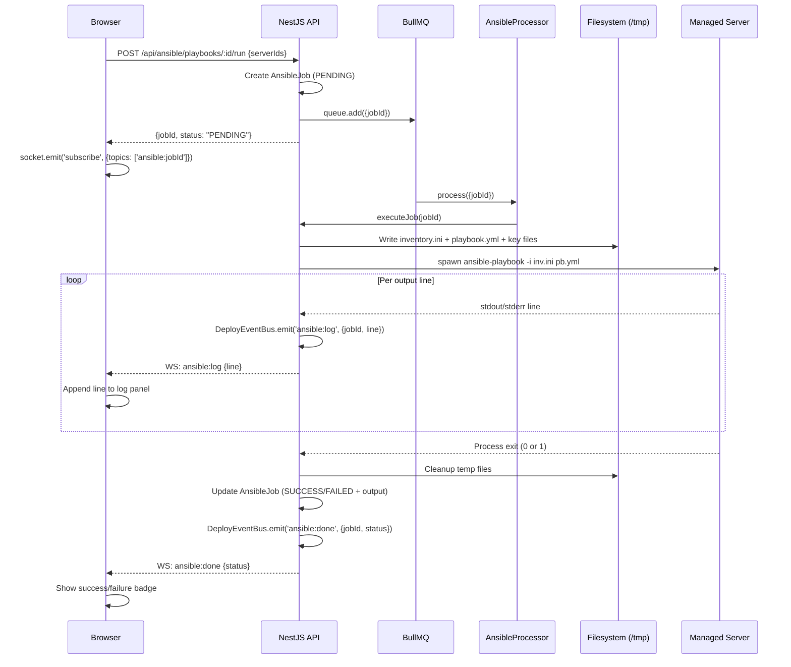

# Architecture Overview

System design, data flow, and module map for Hamyar Ops v1.2.0.

---

## System Architecture

```
┌─────────────────────────────────────────────────────────────────┐
│                         End User Browser                         │
│               Next.js 15 Dashboard (port 3004)                   │
│   React 18 · TanStack Query · Zustand · Socket.IO · Tailwind     │
└────────────────────────────┬────────────────────────────────────┘
                             │ HTTPS (port 443)
                             │ WebSocket (Socket.IO upgrade)
┌────────────────────────────▼────────────────────────────────────┐
│                      Nginx Reverse Proxy                          │
│              /api/*  →  :3005   (NestJS API)                     │
│              /socket.io/* → :3005  (WebSocket)                   │
│              /*      →  :3004   (Next.js UI)                     │
│              SSL: Let's Encrypt via Certbot                       │
└──────────────────┬──────────────────────────────────────────────┘
                   │
┌──────────────────▼──────────────────────────────────────────────┐
│                    NestJS API (port 3005)                         │
│                                                                   │
│  ┌──────────────────────────────────────────────────────────┐    │
│  │                    25 Feature Modules                     │    │
│  │  auth  · users  · pm2  · docker  · nginx  · server       │    │
│  │  logs  · monitoring  · files  · settings  · terminal      │    │
│  │  applications  · env-editor  · app-health  · scheduler    │    │
│  │  backups  · network  · error-logs  · multi-server         │    │
│  │  ansible  · terraform  · pipeline  · registry             │    │
│  │  secrets  · observability  · status                       │    │
│  └──────────────────────────────────────────────────────────┘    │
│                                                                   │
│  ┌──────────────┐  ┌──────────────┐  ┌───────────────────────┐  │
│  │ Events       │  │ BullMQ       │  │ Socket.IO Gateway     │  │
│  │ DeployBus    │  │ 6 queues:    │  │ JWT auth middleware    │  │
│  │ (pub/sub)    │  │ backup       │  │ Room-based broadcast   │  │
│  └──────────────┘  │ app-health   │  │ 25+ event types       │  │
│                    │ app-ssl      │  └───────────────────────┘  │
│                    │ ansible      │                               │
│                    │ terraform    │                               │
│                    │ pipeline     │                               │
│                    │ registry     │                               │
│                    └──────────────┘                               │
└──────┬─────────────────────┬────────────────────────────────────┘
       │                     │
┌──────▼──────┐     ┌────────▼────────┐
│  PostgreSQL  │     │      Redis       │
│  port 5433   │     │   port 6380      │
│  (Docker)    │     │   (Docker)       │
│              │     │  BullMQ queues   │
│  28 models   │     │  Session cache   │
│  Prisma ORM  │     │  Metrics cache   │
└─────────────┘     └────────────────┘
       │
       │ SSH (execFile / ssh2 library)
┌──────▼─────────────────────────────────────────────────────┐
│                   Managed Servers (fleet)                    │
│   Any VPS / bare metal reachable via SSH                    │
│                                                             │
│   ┌──────────┐  ┌──────────┐  ┌──────────┐  ┌──────────┐  │
│   │ Server 1  │  │ Server 2  │  │ Server 3  │  │   ...    │  │
│   │ PM2+Apps  │  │ Docker   │  │ k3s node │  │          │  │
│   └──────────┘  └──────────┘  └──────────┘  └──────────┘  │
└────────────────────────────────────────────────────────────┘
```

---

## Request Flow

### REST API call

```
Browser
  → HTTPS POST /api/servers
  → Nginx (TLS termination, proxy_pass :3005)
  → NestJS JwtAuthGuard (verify Bearer token)
  → RolesGuard (check ADMIN role)
  → MultiServerController.createServer()
  → MultiServerService.createServer()
  → PrismaService.managedServer.create()
  → PostgreSQL
  ← JSON response
```

### WebSocket real-time update

```
Long-running job (e.g. Ansible playbook):
  AnsibleService.executeJob()
    → DeployEventBus.emit('ansible:log', {jobId, line})
    → EventsGateway.subscribe (registered listener)
    → socket.server.to('ansible:${jobId}').emit('ansible:log', data)
    → Browser socket.on('ansible:log', line => appendToLog(line))
```

### Deploy pipeline execution

```
GitHub push → POST /api/pipelines/webhook/:token
  → PipelineController (no auth — token-based)
  → PipelineService.handleWebhook()
  → PipelineService.triggerRun()  [creates PipelineRun + PipelineSteps]
  → BullMQ 'pipeline' queue.add('run', {runId})
  → [async] PipelineProcessor.process()
  → PipelineService.executeRun()
      step: build  → docker build (local/remote/ci)
      step: push   → docker push
      step: deploy → pm2 reload / docker compose up
      step: verify → HTTP health check
  → PIPELINE_STEP events → WebSocket → Browser (live step badges)
  → PIPELINE_DONE event
```

---

## Module Map

### Infrastructure Layer (`src/infrastructure/`)

| Module | Purpose |
|--------|---------|
| `PrismaModule` | Global PostgreSQL ORM — injected into every service |
| `RedisModule` | Global Redis connection — used for caching and BullMQ |
| `SshModule` | Persistent SSH connection pool to the host server (terminal) |
| `EventsBusModule` | `DeployEventBus` — pub/sub bridge between services and WebSocket gateway |

### Feature Modules (`src/modules/`)

#### Auth & Users
| Module | Routes | Description |
|--------|--------|-------------|
| `auth` | `/api/auth/*` | Login, logout, refresh tokens, TOTP 2FA, backup codes |
| `users` | `/api/users/*` | User CRUD, RBAC (ADMIN/VIEWER), password management |

#### Server Management
| Module | Routes | Description |
|--------|--------|-------------|
| `server` | `/api/server/*` | Host server metrics (CPU, RAM, disk, network, processes) |
| `multi-server` | `/api/servers/*` | Fleet management, ping, remote metrics, SSH commands |
| `terminal` | `/api/terminal/*` + WS | Interactive PTY terminal via SSH over WebSocket |
| `files` | `/api/files/*` | File browser, upload, download, edit, permissions |
| `ssh` (infra) | — | Connection pool for `terminal` module |

#### App Management
| Module | Routes | Description |
|--------|--------|-------------|
| `pm2` | `/api/pm2/*` | PM2 process list, start/stop/reload, log streaming |
| `docker` | `/api/docker/*` | Containers, images, volumes, networks, Compose, stats |
| `nginx` | `/api/nginx/*` | Nginx config editor, test and reload |
| `applications` | `/api/applications/*` | App registry, deploy record, version history |
| `env-editor` | `/api/env/*` | Per-app `.env` file read/write |
| `scheduler` | `/api/scheduler/*` | Cron-based app restart schedules |
| `app-health` | `/api/app-health/*` | HTTP health probes, SSL checks, incident tracking |
| `status` | `/api/status/*` | Public status page data |

#### Monitoring & Logs
| Module | Routes | Description |
|--------|--------|-------------|
| `monitoring` | `/api/monitoring/*` | Metrics snapshots, alert rules, alert events |
| `logs` | `/api/logs/*` | Real-time log streaming from PM2, Nginx, system |
| `error-logs` | `/api/error-logs/*` | Centralized error aggregator with dedup fingerprinting |

#### Operations
| Module | Routes | Description |
|--------|--------|-------------|
| `backups` | `/api/backups/*` | Backup strategies, ad-hoc backups, restore, S3 |
| `network` | `/api/network/*` | UFW firewall rule management |
| `settings` | `/api/settings/*` | App-wide settings key-value store |

#### IaC & Pipelines (v1.2.0)
| Module | Routes | Description |
|--------|--------|-------------|
| `terraform` | `/api/terraform/*` | Workspaces, plan/apply runs, module library, S3 state |
| `ansible` | `/api/ansible/*` | Playbook CRUD, job execution, drift detection, key rotation |
| `pipeline` | `/api/pipelines/*` | Deploy pipelines (rolling/blue-green/restart), webhook, schedule |
| `registry` | `/api/registry/*` | Docker registry connections, image builds, list images |
| `secrets` | `/api/secrets/*` | Ansible Vault encrypt/decrypt, HashiCorp Vault status |
| `observability` | `/api/observability/*` | Grafana embed, Prometheus targets, Loki proxy, install stack |

---

## Frontend Architecture

```
apps/web/src/
├── app/
│   ├── (auth)/
│   │   └── login/page.tsx          # Login + TOTP flow
│   └── (dashboard)/
│       ├── layout.tsx              # AuthGuard + Sidebar + Header
│       ├── dashboard/page.tsx      # Overview / home
│       ├── applications/           # App management
│       ├── pm2/                    # PM2 manager
│       ├── docker/                 # Docker manager
│       ├── nginx/                  # Nginx editor
│       ├── server/                 # Host server metrics
│       ├── servers/                # Multi-server fleet
│       ├── infrastructure/         # Terraform
│       ├── ansible/                # Ansible
│       ├── pipelines/              # Deploy pipelines
│       ├── registry/               # Container registry
│       ├── logs/                   # Log viewer
│       ├── error-logs/             # Error aggregator
│       ├── terminal/               # SSH terminal
│       ├── monitoring/             # Metrics & alerts
│       ├── status/                 # Status page
│       ├── files/                  # File manager
│       ├── secrets/                # Secrets manager
│       ├── observability/          # Grafana/Loki
│       ├── users/                  # User management
│       └── settings/               # User settings + 2FA
├── components/
│   ├── layout/
│   │   ├── Sidebar.tsx             # Navigation sidebar
│   │   ├── Header.tsx              # Top bar
│   │   └── ResponsiveComponents.tsx # Card, Grid, ResponsiveTable
│   ├── shared/
│   │   ├── StatusBadge.tsx         # Colored status badges
│   │   └── ConfirmDialog.tsx       # Destructive action modal
│   └── charts/
│       └── MetricCard.tsx          # CPU/RAM/etc metric cards
├── hooks/
│   └── useSocket.ts                # Socket.IO connection hook
├── lib/
│   ├── api.ts                      # Axios client + token refresh
│   ├── socket.ts                   # Socket.IO singleton
│   ├── format.ts                   # formatBytes, formatUptime
│   └── utils.ts                    # cn() tailwind merge
└── stores/
    ├── auth.store.ts               # JWT token + user (Zustand + persist)
    └── sidebar.store.ts            # Sidebar collapse state
```

### State Management Strategy

```
┌─────────────┐     ┌──────────────────┐     ┌───────────────┐
│   Zustand   │     │  TanStack Query  │     │   Socket.IO   │
│  (global)   │     │  (server state)  │     │  (real-time)  │
├─────────────┤     ├──────────────────┤     ├───────────────┤
│ auth token  │     │ GET /api/...     │     │ pm2:status    │
│ user info   │     │ auto-refetch     │     │ docker:stats  │
│ sidebar     │     │ optimistic       │     │ pipeline:step │
│ collapsed   │     │ mutations        │     │ tf:log        │
└─────────────┘     └──────────────────┘     └───────────────┘
```

---

## BullMQ Queue Architecture

```
Redis (:6380)
  ├── queue:backup-strategy      → BackupStrategyProcessor
  │     jobs: run, cleanup
  ├── queue:app-health           → HealthProbeProcessor
  │     jobs: probe (every 60s)
  ├── queue:app-ssl              → SslCheckerProcessor
  │     jobs: check (every 12h)
  ├── queue:ansible              → AnsibleProcessor
  │     jobs: {jobId}
  ├── queue:terraform            → TerraformProcessor
  │     jobs: {runId, command}
  ├── queue:pipeline             → PipelineProcessor
  │     jobs: run (triggered), run (scheduled/repeating)
  └── queue:registry             → RegistryProcessor
        jobs: build {buildId, dto}
```

---

## WebSocket Event Reference

All events flow through the single `EventsGateway` at `/socket.io`.

### Authentication
Connect with Bearer token:
```js
io(WS_URL, { auth: { token: accessToken } })
```

### Subscribe to topics
```js
socket.emit('subscribe', { topics: ['pm2', 'docker', 'pipeline:run-id-123'] })
```

### Event Types

| Event | Topic | Payload |
|-------|-------|---------|
| `pm2:status` | `pm2` | PM2 process list |
| `pm2:log` | `pm2:logs:${appName}` | `{name, line, stream}` |
| `docker:stats` | `docker` | Container CPU/mem stats |
| `docker:event` | `docker` | Container lifecycle event |
| `docker:log` | `docker:logs:${name}` | `{name, line}` |
| `server:metrics` | `server` | CPU, RAM, disk, network |
| `logs:line` | `logs:nginx` / `logs:system` | `{source, line}` |
| `alert:triggered` | — | Alert rule fired |
| `notification:push` | — | `{title, message, severity}` |
| `deploy:start` | `deploy:logs:${app}` | Deploy started |
| `deploy:log` | `deploy:logs:${app}` | `{appName, line}` |
| `deploy:done` | `deploy:logs:${app}` | Deploy completed |
| `backup:start` | `backup:logs:${id}` | Backup started |
| `backup:log` | `backup:logs:${id}` | `{recordId, line}` |
| `backup:done` | `backup:logs:${id}` | Backup completed |
| `terraform:log` | `terraform:${runId}` | `{runId, line, stream}` |
| `terraform:done` | `terraform:${runId}` | `{runId, status, planSummary}` |
| `ansible:log` | `ansible:${jobId}` | `{jobId, line, stream}` |
| `ansible:done` | `ansible:${jobId}` | `{jobId, status, driftReport}` |
| `pipeline:log` | `pipeline:${runId}` | `{runId, line}` |
| `pipeline:step` | `pipeline:${runId}` | `{stepId, stepName, status}` |
| `pipeline:done` | `pipeline:${runId}` | `{runId, status}` |
| `registry:build:log` | `registry:build:${id}` | `{buildId, line}` |
| `registry:build:done` | `registry:build:${id}` | `{buildId, status}` |
| `terminal:output` | — | PTY output bytes |
| `terminal:closed` | — | Session ended |

---

## Data Flow: Ansible Playbook Execution


